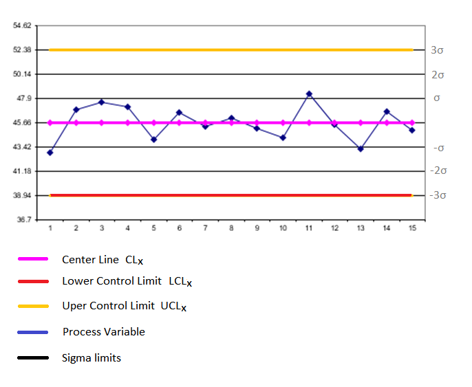

# Always Be In Control
Engineers use a technique called "statistical process control" to manage and improve engineering processes. For example, suppose a manufacturing process is producing widgets of some sort and the diameter of a widget, measured in microns, is important to the ability to use that widget in a later assembly. Many things can affect the diameter of a widget (humidity, temperature, quality of raw materials, etc.), so there is going to be some variation in diameter from one set of widgets to the next. Statistical process control would sample the diameter of a widget over time to make sure that the variation is consistent.

One of the core techniques of statistical process control is a control chart, which is used to monitor some aspect of the process over time to see if the process is behaving consistently. A control chart plots the sampled statistic over time and includes upper and lower control limits that describe the variation in the data. Those control limits are called 3-sigma limits as they represent about three standard deviations away from the mean of the data. Here is an example control chart:



A process is considered to be "in control" with respect to a given variable if its variation is predictable. When analyzing a control chart, the process is out of control if any of the following occur:

1. A single point falls outside the 3-sigma control limits.
2. At least two out of three successive values fall on the same side of, and more than two sigma units away from, the center line.
3. At least four out of five successive values fall on the same side of, and more than one sigma unit away from, the center line.
4. At least eight successive values fall on the same side of the center line.

There are many ways to build control charts and selecting the right one depends on the type of data you have and the question you are trying to answer. For this problem, you are going to build a variation of an Xbar chart, in which we group the data into subgroups of n sequential values. For each subgroup, we compute ri, the range of the values, and Xi, the average of the values. (The range is the maximum value minus the minimum value in the subgroup). The control chart will be a plot of the raw data values (in order). The upper control limit (UCL), lower control limit (LCL), and the center line (CL) are computed as follows:

`UCLX = Xave + A2 Rave`
`LCLX = Xave - A2 Rave`
`CLX = Xave`

Where *Xave* is the average of the *Xi* values, Rave is the average of the range values, and *A2* is a constant that depends on the size of the groups we created, as shown in the table below.
```
Size of group (n)      A2
    2                1.880
    3                1.023
    4                0.729
    5                0.577
    6                0.483
    7                0.419
    8                0.373
    9                0.337
   10                0.308
```

## Input Format
The first line of the input will be an integer between 1 and 20, inclusive, that is the number of test cases in the input.

Each test case will be specified by one line of space separated integers. The first will be *x*, `1 ≤ x ≤ 10,000`, the number of data points in the test case. The second will be *n*, `2 ≤ n ≤ 10`, the number of elements in a subgroup. That will be followed by *x* space separated integers for the test case containing the sequential data gathered from an engineering process. These will be integers with values between -10,000 and 10,000, inclusive.

The last subgroup may be incomplete (i.e. it may not contain n elements). The last subgroup should be treated like a normal subgroup, even if it is incomplete. For example, let's say the subgroup had the entries <1,6,2>. If `n = 10`, this subgroup is incomplete. The range would be 5 `(6 - 1 = 5)`, and the average would be 3 `((1 + 6 + 2)/3 = 3)`. If there is only 1 item in this subgroup, the average would be equal to the number, and the range would be 0.

## Output Format
You are to calculate the three sigma control limits and then test the data to see if it is in control or out of control. For each test case, output, on a line by itself, either "In Control" or "Out of Control" as appropriate.

Note that the output is case-sensitive.

## Sample Input
```
1
25 5 -13 -18 4 15 -3 10 9 -1 17 -1 -2 20 -20 10 -4 2 2 -5 -1 -14 4 -9 13 4 12
```

## Sample Output
```
Out of Control
```

## Explanation
The table below shows the necessary calculations for these 25 data points, given that there are 5 items in a subgroup.

```
DATA     SUBGROUP AVERAGE     SUBGROUP RANGE
 -13        
 -18        
   4        
  15        
  -3              -3                 33
  10        
   9        
  -1        
  17        
  -1             6.8                 18
  -2        
  20        
 -20        
  10        
  -4             0.8                 40
   2        
   2        
  -5        
  -1        
 -14            -3.2                 16
   4        
  -9        
  13        
   4        
  12             4.8                 22

GRAND AVERAGE   1.24               25.8


UCL          16.1266
CENTER LINE     1.24
LCL         -13.6466

SIGMA         4.9622
```

For these calculations, *A2* is 0.577 because we grouped five items in a group. As shown in the table, *Xave* is 1.24, and *Rave* is 25.8. Since the control limits are "3-sigma" lines, sigma is one third of the distance between the center line and the upper control limit.

This process would be considered out of control because there are a number of points, e.g. `-18` and `20`, that are more than three sigma from the center line. Note that in a real world analysis, you would need much more data to draw this conclusion.
