# Binary Quilts
Binary Quilts Incorporated uses custom machinery to make square blankets that consist of 25 black or white squares that are sewn together. Whenever they want to change designs for the blankets, they are limited to a small set of operations, and they would like your help to find the fewest operations needed to change from one design to another.

The designs are specified as a 5 by 5 matrix. The operations that are available change a square region of the matrix. This square region can be any contiguous 1x1, 2x2, 3x3, 4x4, or 5x5 portion of the matrix. The operations on these square regions are:

* Flip a square region of the matrix horizontally.
* Flip a square region of the matrix vertically.
* Negate a square region, i.e. invert all of the colors in this region.

Please see the explanation of the sample input below, for figures with these operations.

## Input Format
The first line of input contains *t*, `1 ≤ t ≤ 5`, which gives the number of test cases.

Each test case is preceded by a blank line.

The test case consists of 5 lines. The first 5 characters in the *ith* line of the test case represent the *ith* row of the source matrix. The sixth character in the row is a space. The last 5 characters in the row represent the *ith* row of the target matrix. The `X` character is used to represent a black square and the `.` character is used to represent a white square.

## Output Format
For each test case, you should output, on a line by itself, the minimum number of operations needed to transform the source matrix into the target matrix.

## Sample Input
```txt
4

..... .....
..... .X...
.X.X. XXX..
..X.. .X...
.X.X. .X...

..... .....
XXX.. XXXX.
X..X. XXXX.
X.... X....
X.... XXXX.

..... .....
X...X XXXX.
XX.XX XXXX.
X.X.X X....
X...X XXXX.

..X.. ..X..
..X.. .X.X.
..X.. .X.X.
..X.. .X.X.
..X.. ..X..
```

## Sample Output
```
4
3
3
1
```

## Explanation
In the first test case, the source matrix can be transformed to the target matrix with four operations. For example,

1. Vertical Flip:  
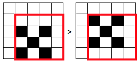

2. Horizontal Flip:  
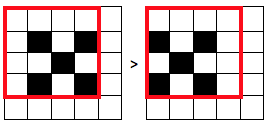

3. Vertical Flip:  
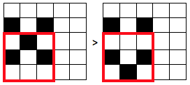

4. Negate:  
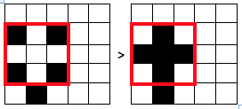

In the second test case, the source matrix can be transformed to the target matrix with three operations. For example,

1. Negate:  
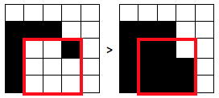

2. Negate:  
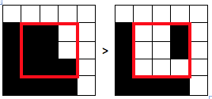

3. Negate:  
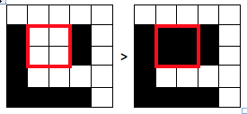

In the third test case, the source matrix can be transformed to the target matrix with three operations. For example,

1. Negate:  
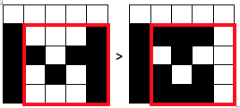

2. Horizontal Flip (or a vertical flip or negate):  
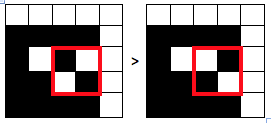

3. Negate (or a vertical flip):  
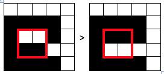

In the fourth test case, the source matrix can be transformed to the target matrix with a single negate operation:  
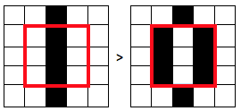
